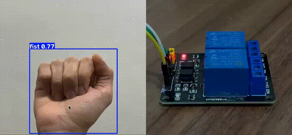
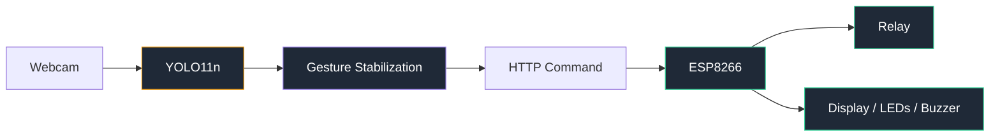
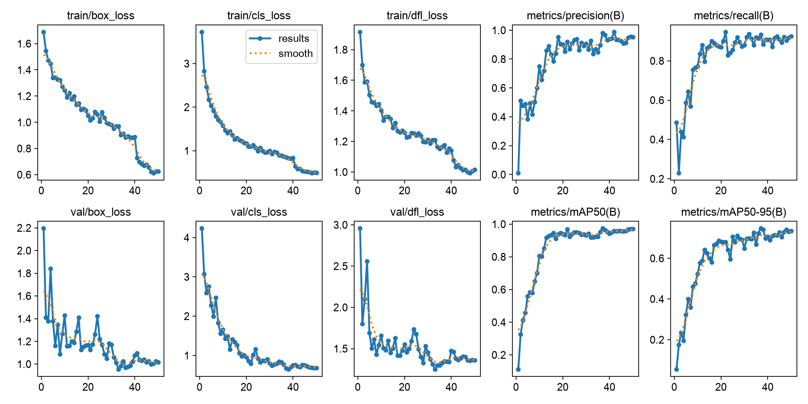
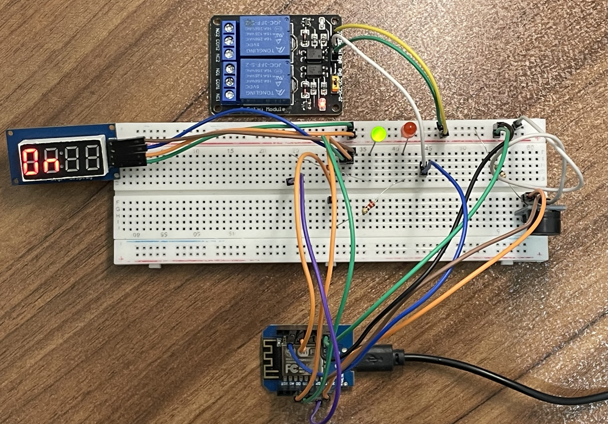
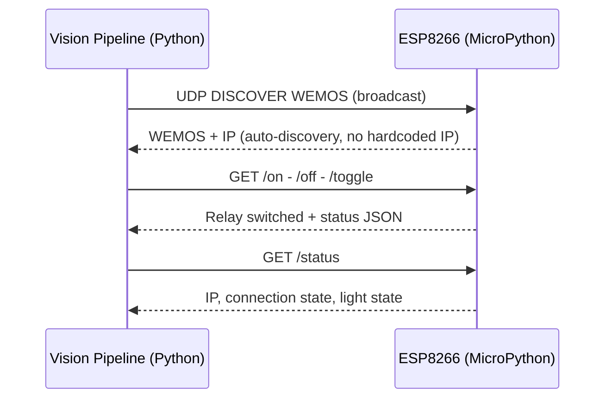

# Gesture Light Controller

Fine-tuned YOLO11n model detects hand gestures in real time via webcam and controls a physical relay (e.g., a lamp) wirelessly through an ESP8266 over Wi-Fi.

[](https://www.python.org/) [](https://pytorch.org/) [](https://github.com/ultralytics/ultralytics) [](https://opencv.org/) [](https://micropython.org/) [](LICENSE)

  

[Demo](#demo) • [Architecture](#architecture) • [Model Performance](#model-choice) • [Hardware](#embedded-hardware) • [Installation](#installation--setup)

## Overview

**Gesture Light Controller** is a real-time system that uses hand gestures captured through a webcam to control a physical light.

The project combines:

- Custom-trained YOLO11n gesture detection
- OpenCV-based real-time inference
- Gesture stabilization logic
- HTTP/UDP communication
- ESP8266-based hardware control

### Demo

<div align="center">



</div>

## Key Features

<div align="center">

| Feature                   | Description                                                |
|---------------------------|------------------------------------------------------------|
|**Custom YOLO11n Model**   |Fine-tuned for 4 hand gestures (`fist`, `one`, `two`, `palm`)|
|**Real-time Inference**    |~35 ms/image on Apple M1 (MPS)                              |
|**Gesture Stabilization**  |Frame-history voting + cooldown to reduce flickering     |
|**Zero Hardcoded IPs**     |Automatic device discovery using UDP broadcast                |
|**Hardware Feedback**      |TM1637 display + status LEDs + buzzer                       |
|**Reliable Control Logic** |Confidence filtering, status API, error handling     |

</div>

## Architecture



**Vision side**: Webcam → OpenCV → YOLO11n → gesture controller → command generation

**Embedded side:** ESP8266 (MicroPython) → Wi-Fi + HTTP server → relay + feedback hardware

**Communication:** HTTP for commands, UDP broadcast for zero-config device discovery (no hardcoded IPs)

## Deep Learning & Computer Vision

### Dataset

The model was fine-tuned using the [Hand Gesture Dataset](https://www.kaggle.com/datasets/souravgarodia/hand-gesture-dataset?select=data.yaml) from Kaggle.

The original dataset contains 4 gesture classes: `go` • `stop` • `left` • `right`

For this project, the class labels were remapped to match light-control gestures: `fist` • `one` • `two` • `palm`

No new dataset was collected. The existing Kaggle dataset was adapted into YOLO object detection format and used to fine-tune the pretrained YOLO11n model.

---

### Model Choice

This project uses an **object detection** approach with **YOLO11n** to detect and classify hand gestures in real time.

<div align="center">
<table>
<tr>
<td valign="top">

### Training Configuration

| Hyperparameter | Value |
|:---|---:|
| Base Model | YOLO11n (COCO pretrained) |
| Image size | 640 px |
| Epochs | 50 |
| Optimizer | AdamW - LR: 0.001 |
| Weight decay | 0.0005 |
| Backend | PyTorch MPS (Apple M1) |

</td>

<td valign="top">

### Model Performance

| Metric | Score |
|:---|---:|
| Precision | 0.981 |
| Recall | 0.932 |
| mAP50 | 0.974 |
| mAP50-95 | 0.747 |
| Inference speed | ~35 ms/frame (Apple M1) |
| Model size | 2.58M params · 6.5 GFLOPs |

</td>
</tr>
</table>
</div>


<details>
<summary><b>Per-class results</b></summary>

<div align="center">

| Class | Precision | Recall | mAP50 | mAP50-95 |
|:---|:---:|:---:|:---:|:---:|
| fist | 0.952 | 0.929 | 0.939 | 0.698 |
| one | 1.000 | 0.801 | 0.967 | 0.749 |
| two | 0.981 | 1.000 | 0.995 | 0.800 |
| palm | 0.989 | 1.000 | 0.995 | 0.740 |

</div>

</details>

Metrics were calculated on a validation set of 49 images. Values may vary due to the limited validation size.

Ultralytics generated training diagnostics:



## Gesture Stabilization Logic

Raw predictions can be unstable:

```text
palm → two → palm → palm
```

**Solution implemented:**

1. **Sliding history buffer** of recent predictions
2. Require **N consecutive matching gestures** (default: 3 frames)
3. **Cooldown period** (2.5 s) after a successful command to prevent repeated triggers

```python
# Simplified logic
if history.count(current_gesture) >= CONFIRM_FRAMES:
    if time.time() - last_trigger > COOLDOWN:
        send_command(current_gesture)
        last_trigger = time.time()
```

This produces stable, human-friendly control.

## Embedded Hardware

<div align="center">

| Component                   | Role                                                            |
|----------------------------|-----------------------------------------------------------------|
| **Wemos D1 Mini (ESP8266)** | Wi-Fi + HTTP server, running MicroPython                        |
| **Relay module**            | Physical light switching                                        |
| **TM1637 4-digit display**  | System status (`BOOT` / `WIFI` / `RDY` / `ON` / `OFF` / `ERR`)  |
| **Red / Green LEDs**        | System state indicators (booting, connecting, ready, error)     |
| **Passive buzzer**          | PWM-based audio feedback for state changes                     |

</div>

Buzzer behavior was tuned empirically across GPIO pins, pull-up configurations, and PWM frequencies to achieve reliable feedback while avoiding unwanted idle noise.

### Wiring

<div align="center">



</div>

## Communication Layer

The vision system and the embedded controller talk over a lightweight **HTTP + UDP** protocol.



## Project Structure

```text
gesture-light-controller/
├── README.md
├── requirements.txt
├── LICENSE
|
├── data/                           # Dataset files and training data
|
├── models/
│   ├── yolo11n-base.pt             # Pretrained YOLO11n base model
│   └── hand-gesture-yolo11n.pt     # Fine-tuned YOLO11n model
|
├── vision/
│   ├── detector.py                 # Webcam + YOLO inference
│   ├── client.py                   # Wemos communication + UDP discovery + HTTP requests
│   ├── controller.py               # Gestures mapping logic
│   ├── train.py                    # Fine-tuning for hand gesture detection
│   └── gesture.py                  # Gesture stabilization logic 
|
├── wemos/
│   ├── main.py                     # MicroPython HTTP server, relay control, discovery
│   ├── config.py                   # Wi-Fi credentials
│   └── tm1637.py                   # TM1637 4-digit display driver
|
├── scripts/
│   ├── deploy.sh                   # Upload files to Wemos using mpremote
│   └── run.sh                      # Execute files using mpremote
|
└── assets/                         # Training results, logs + Demo               
```

## Installation & Setup

### 1. Clone & Install Dependencies

```bash
git clone https://github.com/MiladGolchinpour/gesture-light-controller.git
cd gesture-light-controller
```

```bash
python -m venv .venv
source .venv/bin/activate   # Windows: venv\Scripts\activate
pip install -r requirements.txt
```

### 2. Configure Wi-Fi Credentials

Create `config.py` locally. It contains Wi-Fi credentials:

```bash
cat > wemos/config.py <<EOF
SSID = "YOUR_WIFI_NAME"
PASSWORD = "YOUR_WIFI_PASSWORD"
EOF
```

### 3. Flash ESP8266 Firmware

1. Flash [MicroPython](https://micropython.org/download/#esp8266) on Wemos D1 Mini.
2. Upload the files to the board:

```bash
./scripts/deploy.sh
```

The display should show `BOOT` → `WIFI` → `RDY` during startup.

### 4. Run the Vision System

```bash
python vision/detector.py
```

The vision system will:

- Discover the ESP8266 automatically
- Start webcam inference
- Send stabilized gesture commands

## Gesture Mapping

<div align="center">

| Gesture     | Visual     | Command   | Effect          |
|-------------|------------|-----------|-----------------|
| Open Palm   | 🖐️         | `/on`     | Turn light ON   |
| Fist        | ✊         | `/off`    | Turn light OFF  |
| Two Fingers | ✌️         | `/toggle` | Toggle state    |
| One Finger  | ☝️         | N/A       | Future modes    |

</div>

## Skills Demonstrated

This project covers multiple areas across AI, computer vision, embedded systems, and software engineering:

- **Deep Learning**: YOLO fine-tuning, hyperparameter tuning, and evaluation (mAP, PR curves, confusion matrix)
- **Computer Vision**: Real-time OpenCV pipeline, confidence filtering, and temporal post-processing
- **Systems Integration**: HTTP/UDP communication and automatic device discovery
- **Embedded Systems**: MicroPython on ESP8266, GPIO control, PWM, displays, and relays
- **Python Development**: threading, networking, automation scripts, and hardware communication
